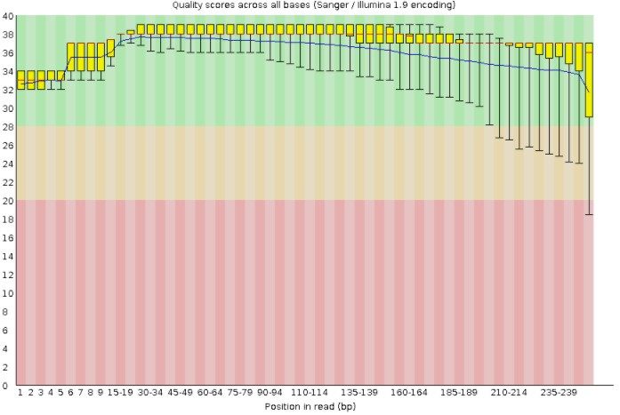

# 1. Initial Quality Assessment of Raw NGS Data
### 1. Commandline FASTQ analysis
Steven Kitchens  
[FASTQ Reports](https://github.com/AUBioInformatics22/Salmonella-Project/tree/main/1%20-%20Initial%20Quality%20Assessment%20of%20Raw%20NGS%20Data/fastqc_reports)  
[Script for SRA-tool fastdump](https://github.com/AUBioInformatics22/Salmonella-Project/blob/main/1%20-%20Initial%20Quality%20Assessment%20of%20Raw%20NGS%20Data/sra_fastqdump_fastqc.sh)
### 2. Galaxy FASTQ analysis
Chidozie Ugochukwu
### 3. Data presentation and report
Stephen Tansie  
[R Script for Data Presentaion](https://github.com/AUBioInformatics22/Salmonella-Project/blob/main/1%20-%20Initial%20Quality%20Assessment%20of%20Raw%20NGS%20Data/Report_1.R)  
[Quality Report]

The goal of this step was to assess the quality of our data using both command line and web-based tools. After downloading data from NCBI (using the sra_fastqdump_fastqc.sh script), we assessed their quality using Galaxy (https://usegalaxy.org/) and on the command line using the Alabama Supercomputer.  Below are representative graphs generated from using both approaches for quality assessment. Ten sequences (SRS5863182, SRS5863183, SRS5863184, SRS5863185, SRS5863186, SRS5863187, SRS5863188, SRS5863189, SRS5863190 and SRS5863191) of paired end whole genome sequences of Salmonella enterica serotype Muenster were analyzed but results are hereby presented for both the forward and reverse reads of the SRS5863191 sequence. 

Per Base Sequence Quality
Below are graphs showing the quality of bases in each sequence read

Forward Read
Graph for Galaxy Assessment

