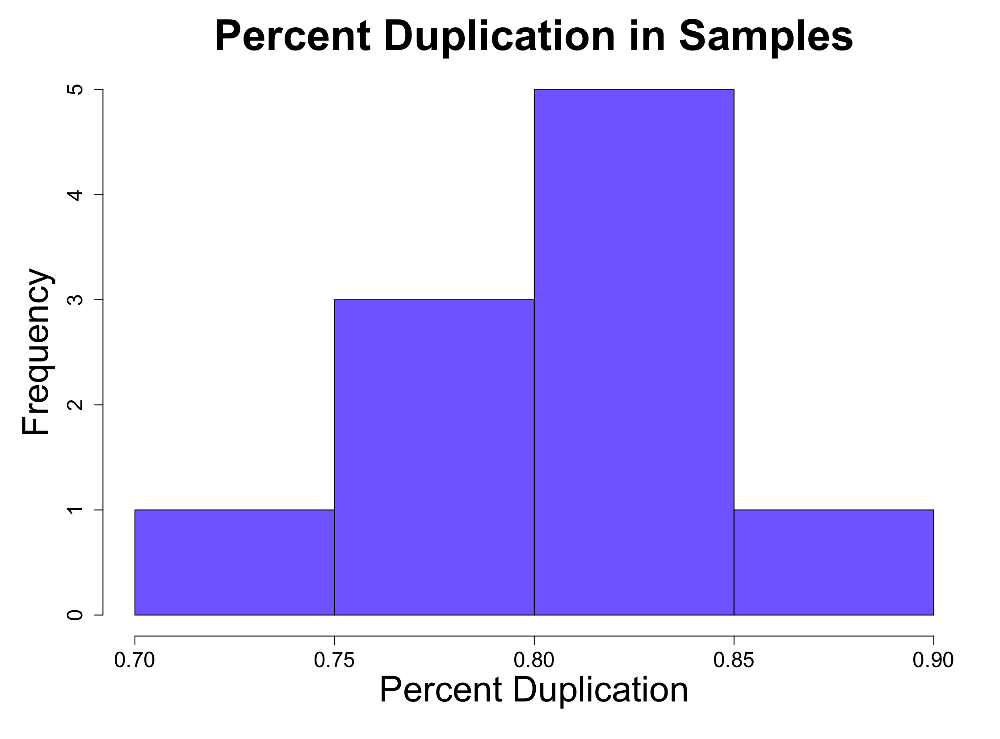
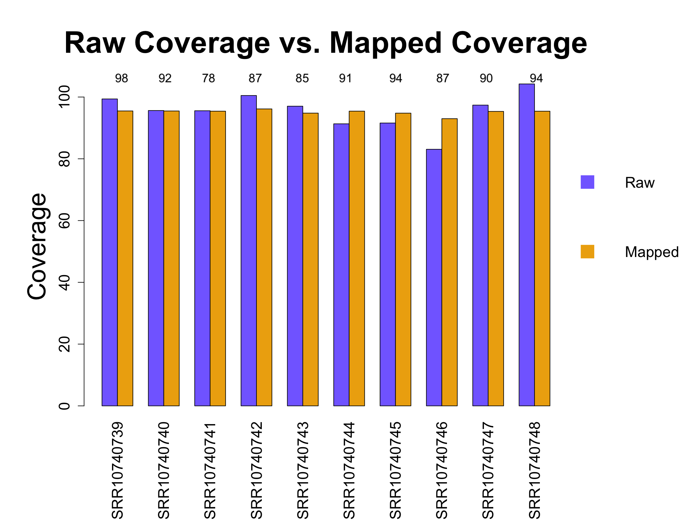
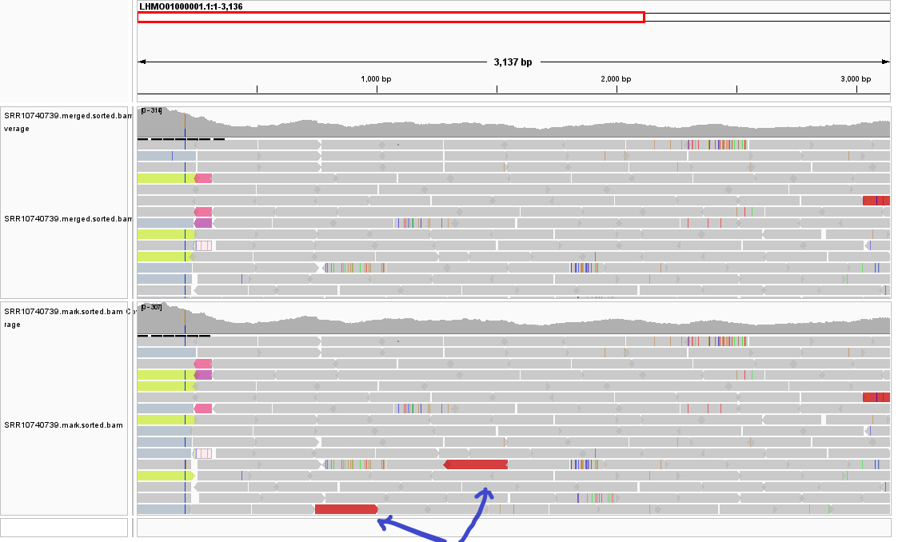
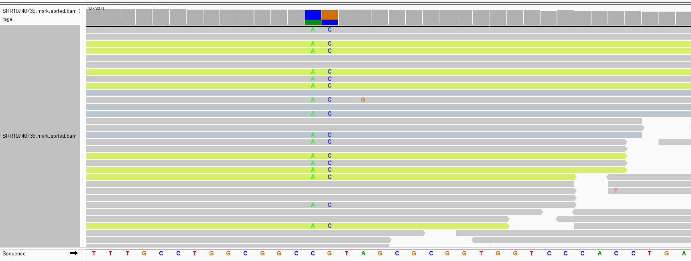

# 3. Post Alignment Processing 
We continued our analysis with the untrimmed data. We used GATK to mark duplictates in our data. After that we used _Samtools flagstat_ to sort and index the duplicated reads. We then used the Integrated Genome Viewer (IGV) to graphically view the outputs before and after marking the duplicates.  

## 1. Analysis and report
We carried out post-alignment processing to mark duplicates in the sequences. The figure below shows that percent duplication among our samples is low. 

                          Figure 1: Percent Duplication among samples.
&nbsp;

Figure 2: Comparison between raw and mapped coverage among samples.
&nbsp;

Figure 2 above shows that mapped coverage minimally reduced, compared to the raw coverage.
&nbsp;

Table 1: Table showing percent duplication among samples.  

| SRA_ID    | Percent Duplication|
|-----------| -----------------  |
|SRR10740739| 0.89               |
|SRR10740740| 0.85               | 
|SRR10740741| 0.74               |
|SRR10740742| 0.80               |
|SRR10740743| 0.78               |
|SRR10740744| 0.81               |
|SRR10740745| 0.83               |
|SRR10740746| 0.80               |
|SRR10740747| 0.81               |
|SRR10740748| 0.82               | 
&nbsp;
  

Table 1 above shows that there is minimal sequence duplication among the samples.
&nbsp;

**IGV** 

Fig 3 displays IGV screenshot of two alignments tracks covering the same genomic region on one of our samples (SRR10740739): The raw bam files (upper track)
and the lower track corresponding to the marked bam files. Marking the bam files using the Picard tools of GATK highlights likely duplications events 
(see blue arrows) that were not originally captured in the raw bam files. 
  
 

 

Fig 4: Marked bam files displaying colored histograms on the read coverage tracks that highlight potential SNPs as well as the alternate allele frequency 
(when the histogram is clicked on). Possible SNPs at positions 203 and 204 on one of our samples (SRR10740739) is shown here as reference.   
The reference allele -A and C – have been substituted by the alternative alleles C and G.  .
&nbsp;

## 2. 🤯 Troubleshooting
Looking at the output files from the queue jobs we got an error message:
> *WARNING 2022-04-04 22:21:50     AbstractOpticalDuplicateFinderCommandLineProgram        A field field parsed out of a read name was expected to contain an integer and did not. Read name: SRR10740741.1004. Cause: String 'SRR10740741.1004' did not start with a parsable number.*  

1. Check the input files if they meet the [requirements for GATK](https://gatk.broadinstitute.org/hc/en-us/articles/360035890791-SAM-or-BAM-or-CRAM-Mapped-sequence-data-formats) with:  
`samtools view -H samplename.bam` or  
`samtools view -H samplename.bam | grep '^@RG'`  

Output for our files: 
> *@RG	ID:foo	SM:bar*  

instead of the required individual ID for each sample  
To fix this issue we use  
`gatk AddOrReplaceReadGroups I input.bam O output.bam RGID Sample_ID RGLB Library_name RGPL Sequencing_platform RGPU Units RGSM Sample_name`  
for each sample to add the readgroup parameters manually. The information about our readgroups can be found in the [add_readgroups.sh script](https://github.com/AUBioInformatics22/Salmonella-Project/blob/main/3%20-%20Post-alignment%20processing/add_readgroups.sh). More information about the GATK feature `AddOrReplaceGroups` can be found [here](https://gatk.broadinstitute.org/hc/en-us/articles/360037226472-AddOrReplaceReadGroups-Picard-).  

6. Check the output files with GATK feature `ValidateSamFiles` and in the IGV viewer. If everything is fine with the files the output of the script [7_GATK_ValidateSam.sh](https://github.com/AUBioInformatics22/Salmonella-Project/blob/main/3%20-%20Post-alignment%20processing/7_GATK_ValidateSam.sh) for each sample is: 
> *No errors found*

## 3. Contributions
Steven Kitchens: Script for mapping  
Stephen Tansie: Analysis and report  
Chidozie Ugochukwu: Analysis with IGV  
Andrea Pietruska: Graph design in R, troubleshooting, GitHub Repository
