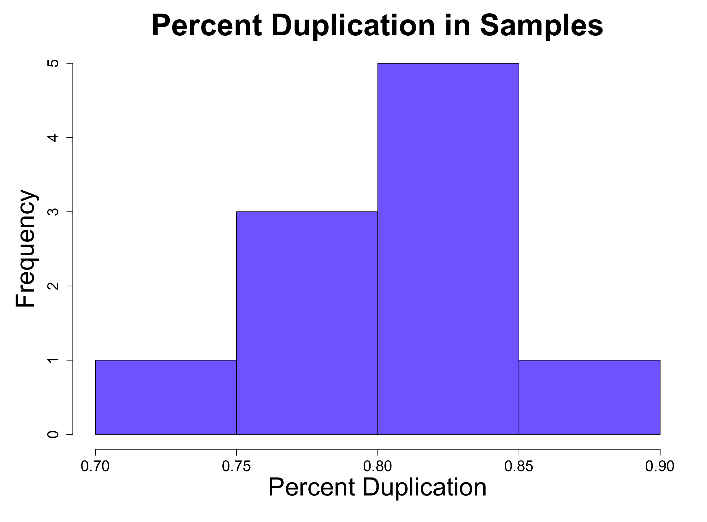

# Post-alignment processing was carried out to mark duplicates in the sequences.  

 
                                                                                               Figure 2
                                                                                                          
&nbsp;

Table 1: Table showing the coverage of the data after post-alignment processing 

| SRA_ID    | Percent Duplication|
|-----------| -----------------  |
|SRR10740739| 0.89               |
|SRR10740740| 0.85               | 
|SRR10740741| 0.74               |
|SRR10740742| 0.80               |
|SRR10740743| 0.78               |
|SRR10740744| 0.81               |
|SRR10740745| 0.83               |
|SRR10740746| 0.80               |
|SRR10740747| 0.81               |
|SRR10740748| 0.82               | 
&nbsp;
  

Table 1 above shows that there is minimal sequence duplication in the samples. 

